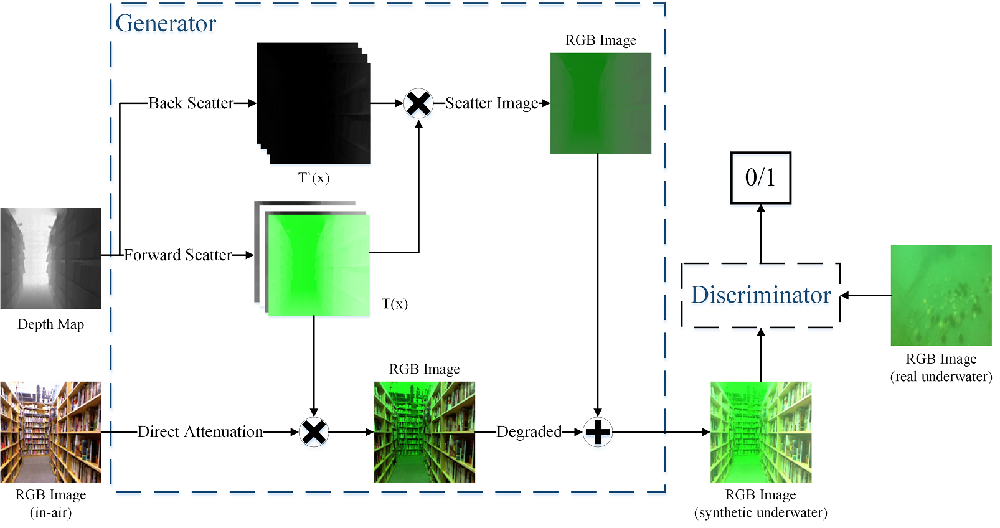
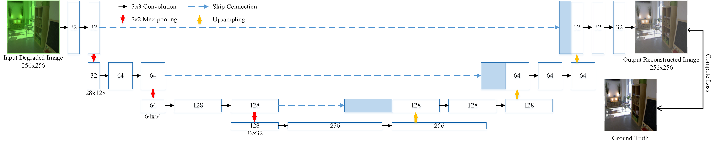

- This repository contains source code for the method developed in [UWGAN: Underwater GAN for real-world underwater color restoration and dehazing](https://arxiv.org/abs/1912.10269)
- This code is modified from [WaterGAN](https://github.com/kskin/WaterGAN) and [UNet image segmentation](https://github.com/jakeret/tf_unet)


# Network Structure

## UWGAN for generating realistic underwater images

UWGAN takes color image and its depth map as input, then it synthesizes underwater realistic images based on underwater optical imaging model by learning parameters through generative adversarial training. You can find more details in the [paper](https://arxiv.org/abs/1912.10269).




Synthetic underwater-style images through UWGAN. (a) are in-air sample images, (b)-(d) are synthetic
underwater-style sample images of different water types.


## Underwater image restoration based on UNet

Proposed U-net Architecture for underwater image restoration and enhancement. The effects of different
loss functions in U-net are compared, the most suitable loss function for underwater image restoration is suggested based on the comparison, you can find more details about loss function in [paper](https://arxiv.org/abs/1912.10269).



# Dataset

Download data:

1. In-air RGBD data: [NYU Depth Dataset V1](https://cs.nyu.edu/~silberman/datasets/nyu_depth_v1.html), [NYU Depth Dataset V2](https://cs.nyu.edu/~silberman/datasets/nyu_depth_v2.html)

2. Underwater images: [[Baidu Cloud Link](https://pan.baidu.com/s/1lC5YIkEtGmtl-m1V7TQNkw)] [[Google Drive](https://drive.google.com/open?id=1S2T5gZbdNe9KvVqGf-Neul3clRrpymPo)]

3. UIEB Dataset for verification: [[github link](https://li-chongyi.github.io/proj_benchmark.html)]

4. The NYU datasets we used to train UWGAN: [[Baidu Cloud Link](https://pan.baidu.com/s/1msG0UjvRCT391HyiWuFiVQ)] [[Google Drive](https://drive.google.com/open?id=1q1FEcuhMPtqjJgaPSriL8EiBYA-mNGZv)]

5. fake water images generated from UWGAN: [[Google Drive](https://drive.google.com/open?id=1Vy1HtFYY9U7QlMa0Qo8EGCTBuR3_QWb-)]

6. pretrained model:[[Google Drive](https://drive.google.com/file/d/14SowRxenGwvjkRmGlSfDm8o9iX0m-mEX/view?usp=sharing)]

Data directory structure in UWGAN

```
.
├── ...
├── data                    
│   ├── air_images
│   │   └── *.png
│   ├── air_depth  
│   │   └── *.mat
│   └── water_images 
│       └── *.jpg
└── ...
```

# Usage

* Train a UWGAN model - Firstly, change directory to UWGAN folder, then run `python uwgan_mian.py`, you can adjust learning parameters in `uwgan_main.py`.
* Train a UNet restoration model - Firstly, change directory to UNetRestoration folder, then run `python train.py`, you can adjust learning parameters and change loss functions in `train.py`. Run `python test.py` after training has been completed.

# Results and Discussion

* Underwater image restoration through our approach. Our method is tested on both [UIEB public benchmark](https://li-chongyi.github.io/proj_benchmark.html) and [Our underwater images collected from marine organisms’ farms](https://pan.baidu.com/s/16NCfZoZUOFMbWLNYYr6xNw).


* High-level computer vision task: underwater target detection on underwater images before and after processing with our method.


* The effects of different loss functions in restoration network (UNet)

  

# Citations

If you find this work useful for your research, please cite this article in your publications.

```
@misc{wang2019uwgan,
    title={UWGAN: Underwater GAN for Real-world Underwater Color Restoration and Dehazing},
    author={Nan Wang and Yabin Zhou and Fenglei Han and Haitao Zhu and Yaojing Zheng},
    year={2019},
    eprint={1912.10269},
    archivePrefix={arXiv},
    primaryClass={eess.IV}
}
```

